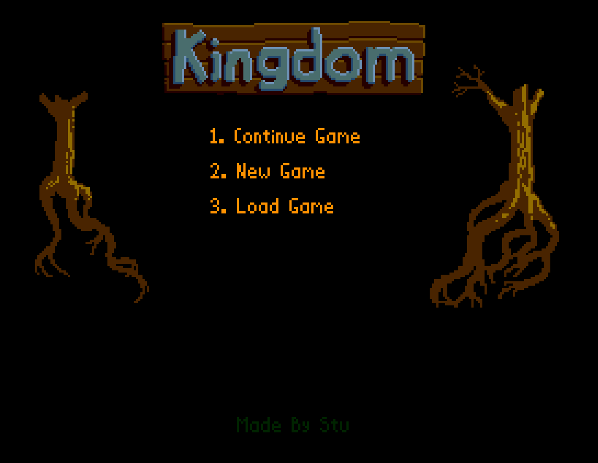
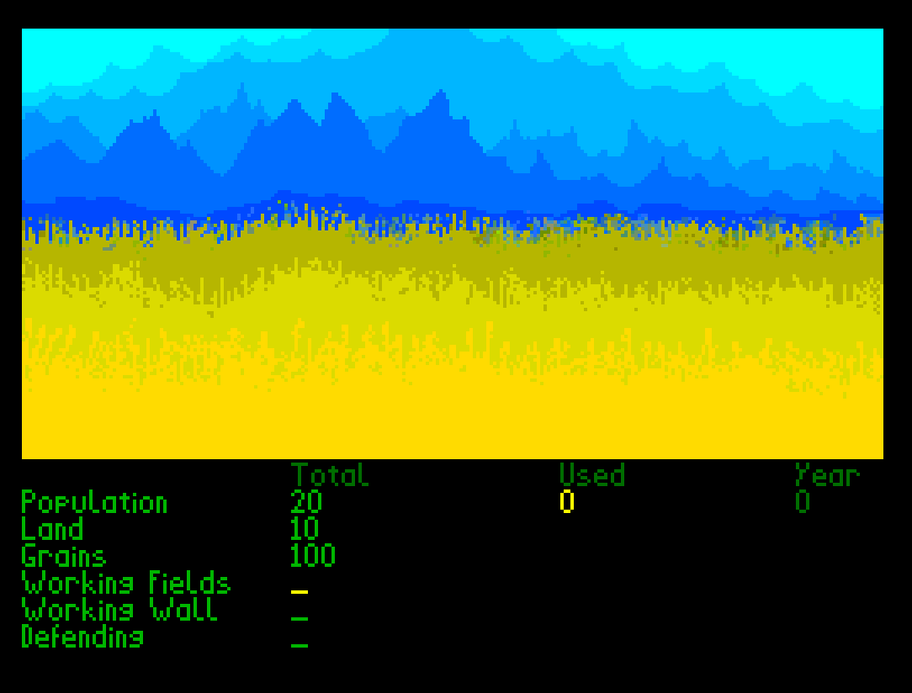
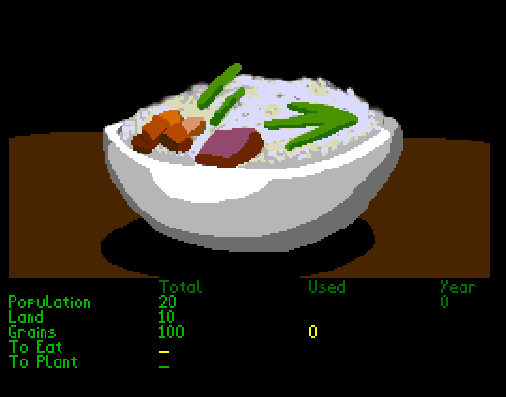
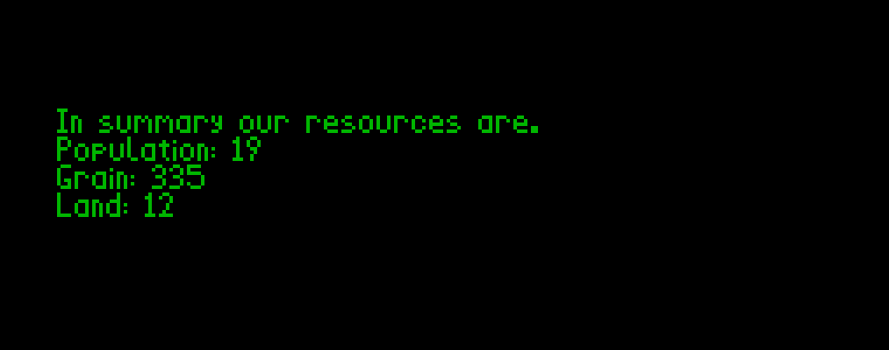

# Kingdom

### A resource management game for the ZX Spectrum Next.

ZX-Next-Kingdom Copyright (c) 2025 Stuart Geddes.
Based on the ULA C Framework for the ZX Spectrum Next by Mike Dailly 2025. Edited to work with the ZX Nexts Layer 2 display running at a resolution of 256x192 pixels.

This (and the original framework) is licensed by the MIT License, so feel free to use this code any way you want.

## Game Play

Kingdom is heavily based on the first computer game I played, Kingdom on the Apple II. I don't expect anyone to remember this game, it was a long time ago and on a computer not many people had. I also don't know exactly how the numbers worked in kingdom, so I have used my own understanding and judgement of how they should work for this game.

### Start Game

For your first game press 2 New Game.

If you have played before you can press 3 Load Game, to choose a save game to load. Or 1 Continue Game to contine the last played game.

*Only New Game is currently implemented*

### Playing the Game

On this page you assign the amount of people to do a certain job for the year to come.
Here the yellow cursor is on the top item, "Working Fields". Type in a number to assign people and press Enter or arrow down to go to the next item.

You have 20 Population at the moment so don't try to assign more than that in total.

When you press Enter on the bottom item the page will go to the next resource to assign.

Next we assign the Grain, how many we give to the people to eat and how many we plant.

Note we don't need to assign all of a resource, it can be useful (often useful) to only assign some of the resource.

After assigning Grains the year is run and we see the results of our decisions.

You will see several screens with detail of each event with a summary page at the end.

